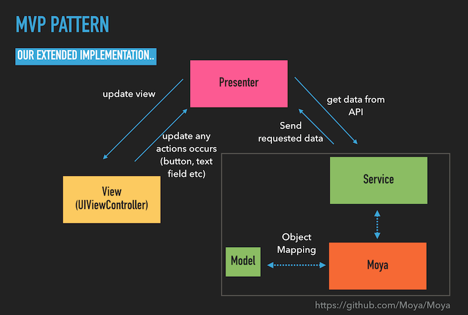

# iOS MVP Project with Moya
iOS project in swift with MVP (Model-View-Presenter) architecture. This example project is integrated with [Github public API](https://developer.github.com/v3/)

### Specification

- Architecture: MVP (Model-View-Presenter) + Data Services
- Xcode 8+
- Support iOS 9+
- Swift 3+
- Cocoapods

### Common Pods
- [Moya](https://github.com/Moya/Moya)
- [ObjectMapper](https://github.com/Hearst-DD/ObjectMapper)
- UserDefaults with [SwiftyUserDefaults](https://github.com/radex/SwiftyUserDefaults)

### Current Feature:
- Github users page
- Github repositories page

### Todo
- Pull to refresh
- Tap to reload (if failed request)
- Reachability
- Authentication
- Unit test
- etc

### Reference
- [http://iyadagha.com/using-mvp-ios-swift/](http://iyadagha.com/using-mvp-ios-swift/)

### License
Licensed under the [MIT license](http://opensource.org/licenses/MIT)
