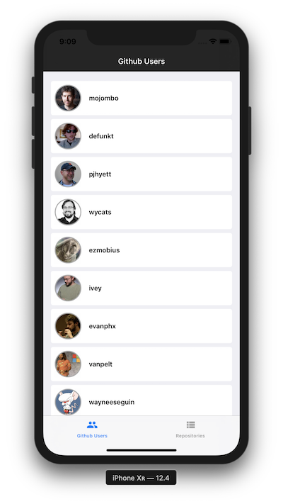

# iOS MVP Project
iOS project in swift with MVP (Model-View-Presenter) architecture. This example project is integrated with [Github public API](https://developer.github.com/v3/)

### Specification
- Architecture: MVP (Model-View-Presenter) + Data Services
- Xcode 8+
- Support iOS 9+
- Swift 3+
- Cocoapods

### Common Pods
- Moya
- Rx
- ObjectMapper

### Current Feature:
- Github users page listing
- Github repositories

### To be added
- Detail repository
- Authentication
- Unit test
- etc
